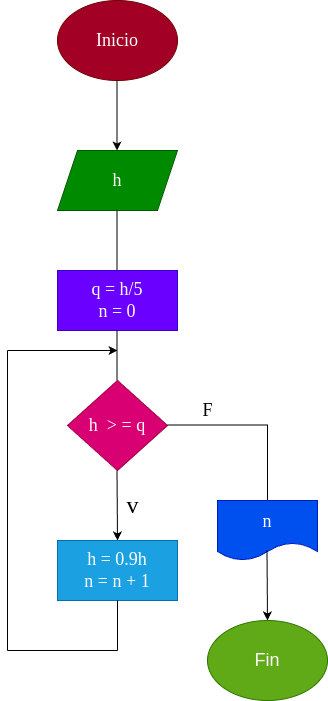

# While_2

# Analisis

Una pelota se deja caer desde una altura H, y en cada rebote sube 10 % menos que el anterior. Hacer el diagrama de flujo y el programa en python, que lea H y que calcule e imprima en cual rebote la pelota no alcanza a subir la quinta parte de la altura inicial

## Input

### Variables de entrada

h: Ingrese la altura a la cual somete la pelota

### Proccesing
q: h / 5

n = 0

Mientras h > q:

h * 0.9

n + 1

### Output
n

# Diseño

# Construcción